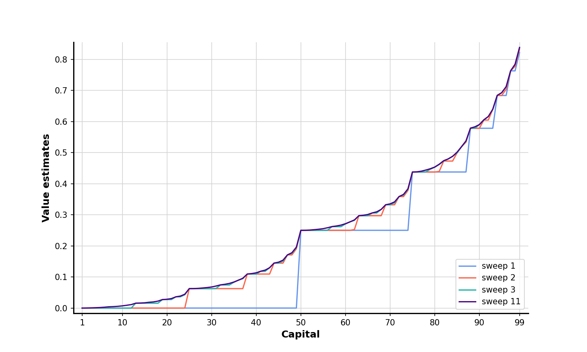
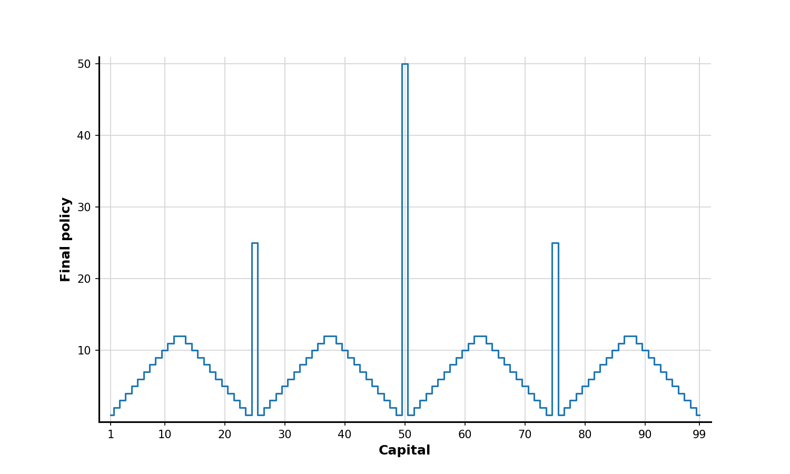

# Reinforcement Learning 2nd Edition - Notes and Codes

*Reinforcement Learning - An Introduction, 2nd Edition*, written by Richard S. Sutton and Andrew G. Barto, is kind of bible of reinforcement learning. It is a required reading for students and researchers to get the appropriate context of the keep developing field of RL and AI.  

Links to get or rent a hardcover or ebook: [MIT Press](https://mitpress.mit.edu/9780262039246/reinforcement-learning/), [Amazon](https://www.amazon.com/Reinforcement-Learning-Introduction-Adaptive-Computation/dp/0262039249/ref=sr_1_4?keywords=reinforcement+learning+an+introduction&qid=1684469272&sprefix=reinforcement+le%2Caps%2C82&sr=8-4&ufe=app_do%3Aamzn1.fos.006c50ae-5d4c-4777-9bc0-4513d670b6bc) (Paperback version if generally not recommended because the poor printing quality). 

### **Motivation of this project:**
Although the authors have made the book extremely clear and friendly to readers at each level, this book is honestly still intimidating to RL or ML beginners because of the intense concepts, abstract examples and algorithms, and its volume. Therefore, as an RL researcher, I'm trying to extract key points and implement examples as well as exercises in the book to help more people better understand the valuable knowledge the book generously provides. 
 
My work mainly consists of: 
- Turning examples into code and plots that are as close to that of in the book as possible;
- Implementing algorithms in `Python` and testing them with RL playground packages like [`Gymnasium`](https://gymnasium.farama.org/);
- Take notes and organize them as PDF files per chapter.
 

## **Snapshot of chapters**:
### **Chapter 2: Multi-armed Bandits** &nbsp; &nbsp; :link: [link](/chapter_02_k_armed_bandits/)
 This chapter starts with bandit algorithm and introduces strategies like $\varepsilon$-greedy, Upper-Confidence-Bound, and Gradient Bandit to improve the the algorithm's performance.
- A k-armed bandit testbed:

    

- Parameter study (algorithm comparison) - stationary environment

    

### **Chapter 3: Finite Markov Decision Process** &nbsp; &nbsp; :link: [link](/chapter_03_finite_MDP/)
This chapter introduces the fundamentals of the Markov Decision Process in finite states like agent-environment interaction, goals and rewards, returns and episodes, and policy and value function. It helps to build up a basic understanding of the components of reinforcement learning.
- Optimal solution to the `gridworld` example:

    
    

### **Chapter 4: Dynamic Programming**  &nbsp; &nbsp; :link: [link](/chapter_04_dynamic_programming/)
The dynamic programming (DP) methods introduced in this chapter includes policy iteration, which consists policy evaluation and policy improvement, and value iteration, which considered a concise and efficient version of policy iteration. The chapter puts up a topic that the evaluation and improvement process compete with each other but also cooperate to find the optimal value function and an optimal policy.

- Jack's Car Rental example

    
    

- Gambler's problem

    
    

### **Chapter 5: Monte Carlo Methods**  &nbsp; &nbsp; :link: [link](/chapter_05_monte_carlo_methods/)

Monte Carlo methods can be used to learn optimal behavior directly from interaction with the environment, with no model of the environment's dynamics. The chapter introduces on-policy MC methods like first-visit Monte Carlo prediction with/without Exploring Starts, and off-policy MC methods like ordinary/weighted importance sampling.

- The infinite variance of ordinary importance sampling

    

- Racetrack

    

    

### **Chapter 6: Temporal-Difference Learning** &nbsp; &nbsp; :link: [link](/chapter_06_temporal_difference_learning/)

This chapter introduced temporal-difference (TD) learning, and showed how it can be applied to the reinforcement learning problem. The TD control methods are classified according to whether they deal with the complication by using and on-policy (SARSA, expected SARSA) or off-policy (Q-learning) approach. The chapter also discussed using double learning method to avoid maximization bias problem.

- Comparison of TD(0) and MC on Random Walk environment

    
    

- Interim and Asymptotic Performance of TD methods

    

### **Chapter 7: $n$ -step Bootstrapping** &nbsp; &nbsp; :link:[link](https://github.com/terrence-ou/Reinforcement-Learning-2nd-Edition-Notes-Codes/tree/main/chapter_07_n_step_bootstrapping)

*In progress*