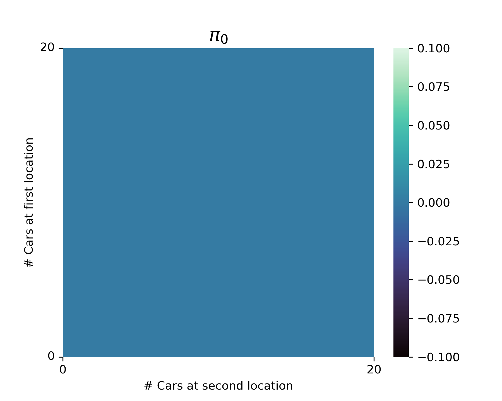
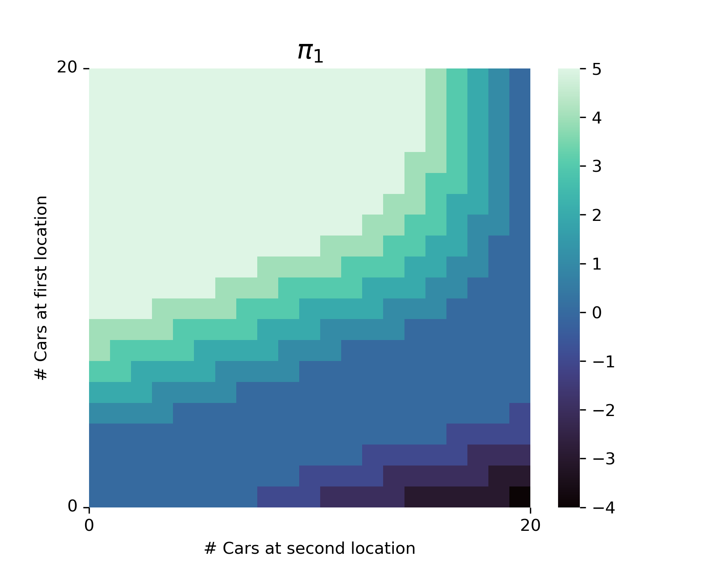
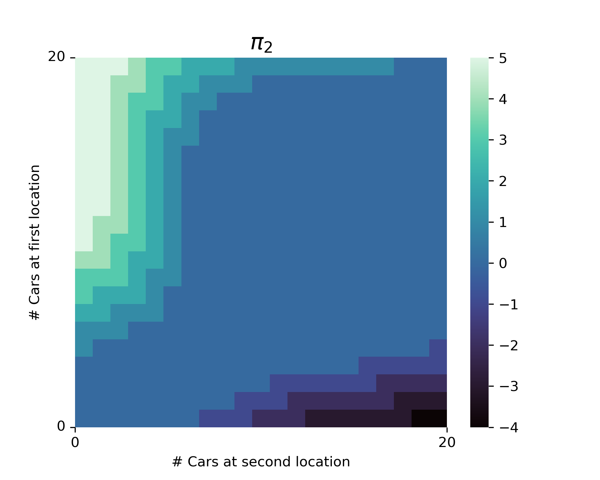
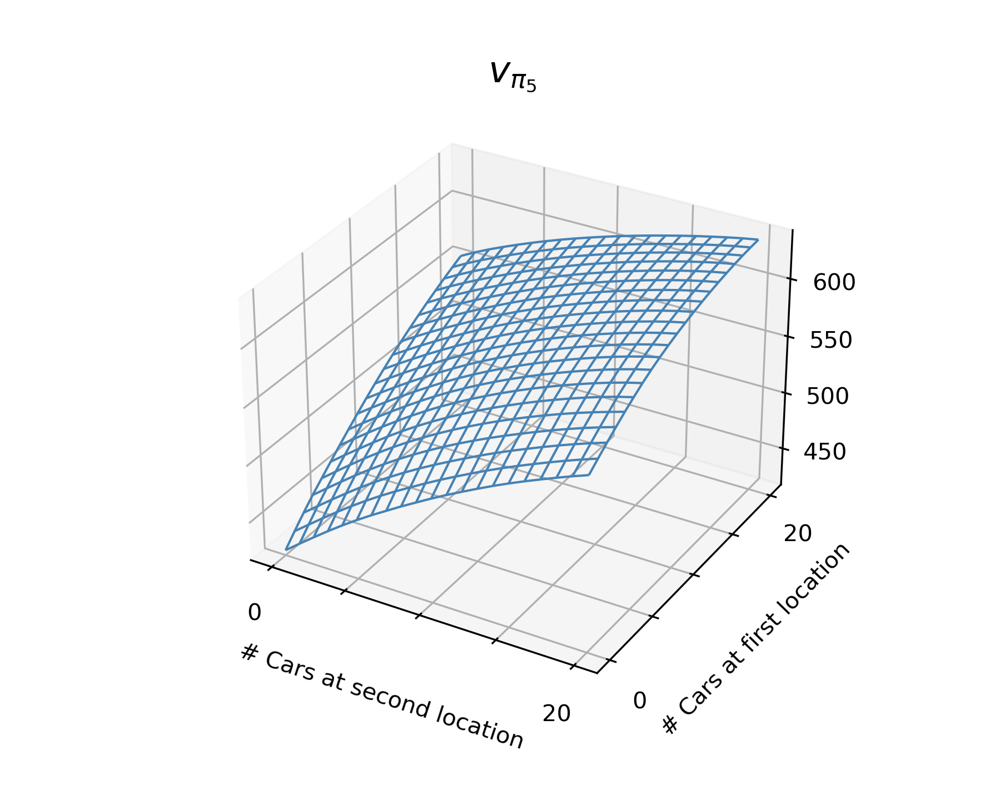

# **Chapter 4: Dynamic Programming** &nbsp; &nbsp; :link: [Notes](./%5BNOTES%5DCH_4.pdf)
## **Examples**

### 4.1 Policy Evaluation Gridworld (*p.77*)
Convergence of iterative policy evaluation on a small gridworld. The last policy is guaranteed only to be an improvement over the random policy, but in this case it, and all policies after the third iteration, are optimal.
[Code](./example_4_1_policy_evaluation.py)
<p align="center">
    
</p>

### 4.2 Jack's Car Rental (*p.81*)
The sequence policies found by policy iteration on Jack's car rental problem, and the final state-value function. The first four diagrams show, for each number of cars at each location at the end of the day, the number of cars to be moved from the first location to the second (negative numbers indicate transfer from the second location to the first).<br>
**Special attention:** The MDP part of the Jack's Car Rental environment comes from Gertjan Gsverhoeven's 
implementation under the MIT Liscence: [GitHub](https://github.com/gsverhoeven/gym_jcr/blob/main/gym_jcr/jcr_mdp.py)<br>
Before running this example, be sure to first install the Jack's Car Rental environment by:
```bash
cd gym_env
pip install .
```
<p align="center">
    
    
    
</p>
<p align="center">
    
    
</p>