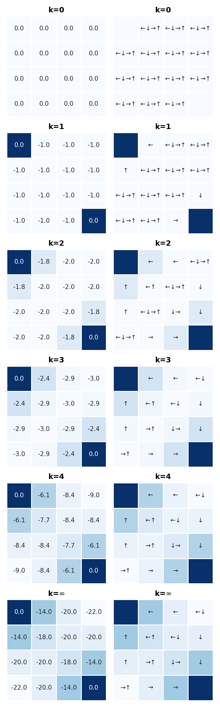

# **Chapter 4: Dynamic Programming** &nbsp; &nbsp; :link: [Notes](./%5BNOTES%5DCH_4.pdf)
## **Examples**

### 4.1 Policy Evaluation Gridworld (*p.77*)
Convergence of iterative policy evaluation on a small gridworld. The last policy is guaranteed only to be an improvement over the random policy, but in this case it, and all policies after the third iteration, are optimal.
[Code](./example_4_1_policy_evaluation.py)

    

