# **Chapter 4: Dynamic Programming** &nbsp; &nbsp; :link: [Notes](./%5BNOTES%5DCH_4.pdf)
## **Examples**

### 4.1 Policy Evaluation Gridworld (*p.77*)
Convergence of iterative policy evaluation on a small gridworld. The last policy is guaranteed only to be an improvement over the random policy, but in this case it, and all policies after the third iteration, are optimal.
[Code](./example_4_1_policy_evaluation.py)
<p align="center">
    
</p>

### 4.2 Jack's Car Rental (*p.81*)
The sequence policies found by policy iteration on Jack's car rental problem, and the final state-value function. The first four diagrams show, for each number of cars at each location at the end of the day, the number of cars to be moved from the first location to the second (negative numbers indicate transfer from the second location to the first).
[Code](./example_4_2_JacksCarRental.py)
<br>

#### **Special attention:** 
The MDP part of the Jack's Car Rental environment is based on Gertjan Gsverhoeven's implementation, which uses the MIT Liscence: [GitHub](https://github.com/gsverhoeven/gym_jcr/blob/main/gym_jcr/jcr_mdp.py)<br>
####
Before running this example, be sure to first install the Jack's Car Rental environment by:
```bash
cd gym_env
pip install .
```
<p align="center">
    
    
    
</p>
<p align="center">
    
    
</p>

### 4.3 Gambler's Problem (*p.84*)

A gambler has the opportunity to make bets on the outcomes of a sequence of coin flips. If the coin comes up heads, he wins as many dollars as he has staked on that flip; if it is tails, he loses his stake. In this example, the probability of the coin comming up head is $p_h = 0.4$. The first plot shows the change in the value function over successive sweeps
of value iteration, and the second plot shows one of the optimal policy found.
[Code](./example_4_3_gambler.py)
<p align="center">
    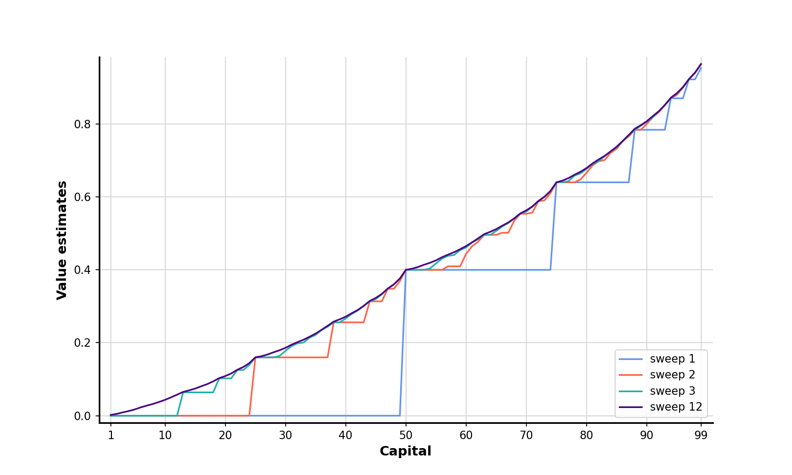
    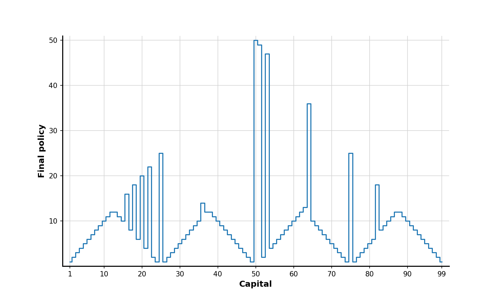
    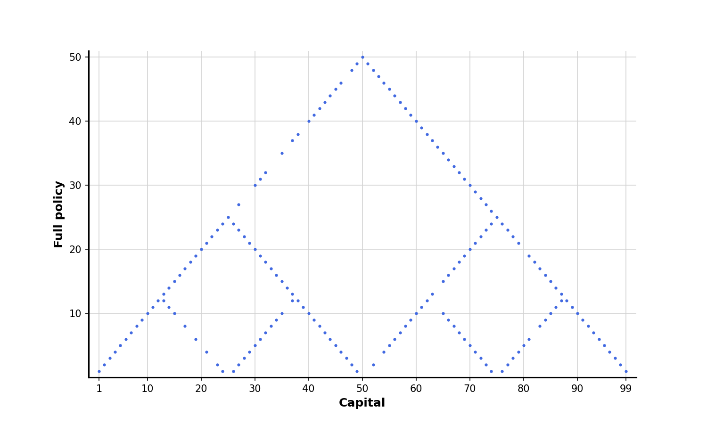
</p>

## **Exercises**
### 4.7 Re-solve Jack's Car Rental problem (*p.82*)
One of Jack's employee's happy to shuttle the a car from the location to the second for free. Moreover, if there's more than 10 cars are kept overnight at a location (after any moving of cars), an additional cost of $4 must be incurred to use a second parking lot.
[Code](./exercise_4_7_resolve_JacksCarRental.py)
<br>
To create the Re-solve Jack's Car Rental environment, the `resolve=True` needed to be included as an argument when initialing the environment:
```python
env = gymnasium.make('JacksCarRental-v0', resolve=True)
```
<p align="center">
    
    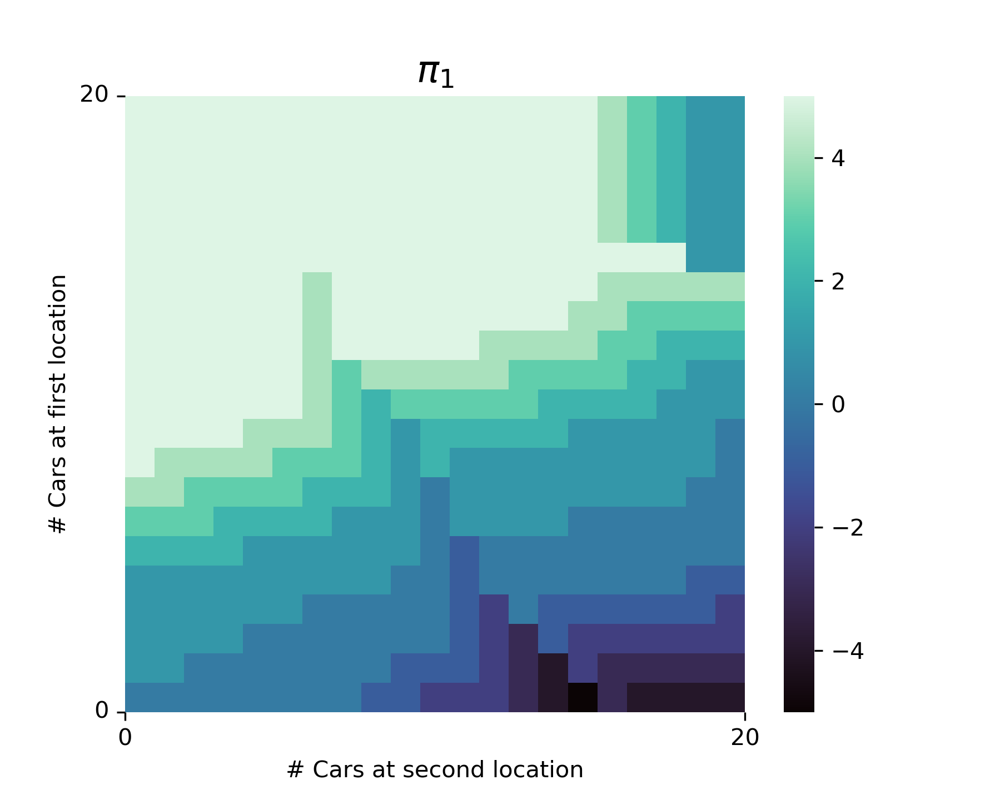
    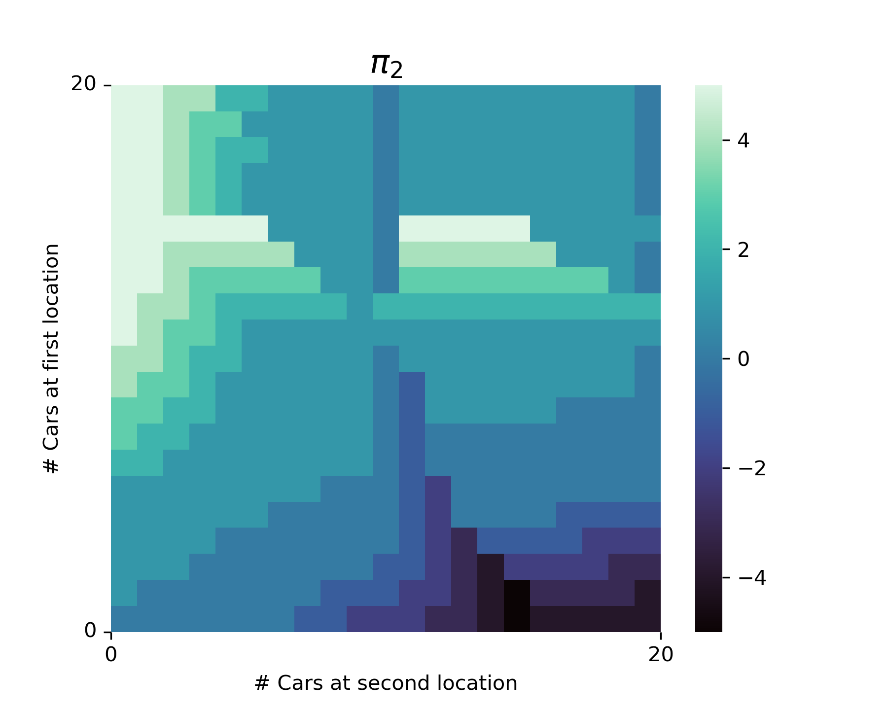
</p>
<p align="center">
    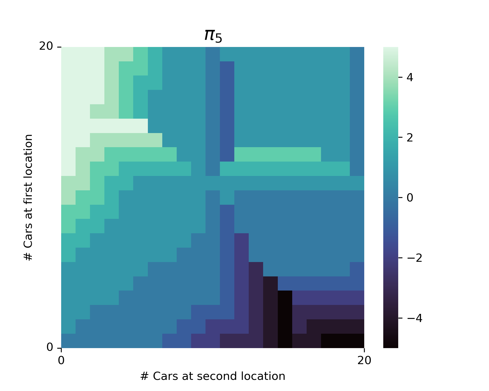
    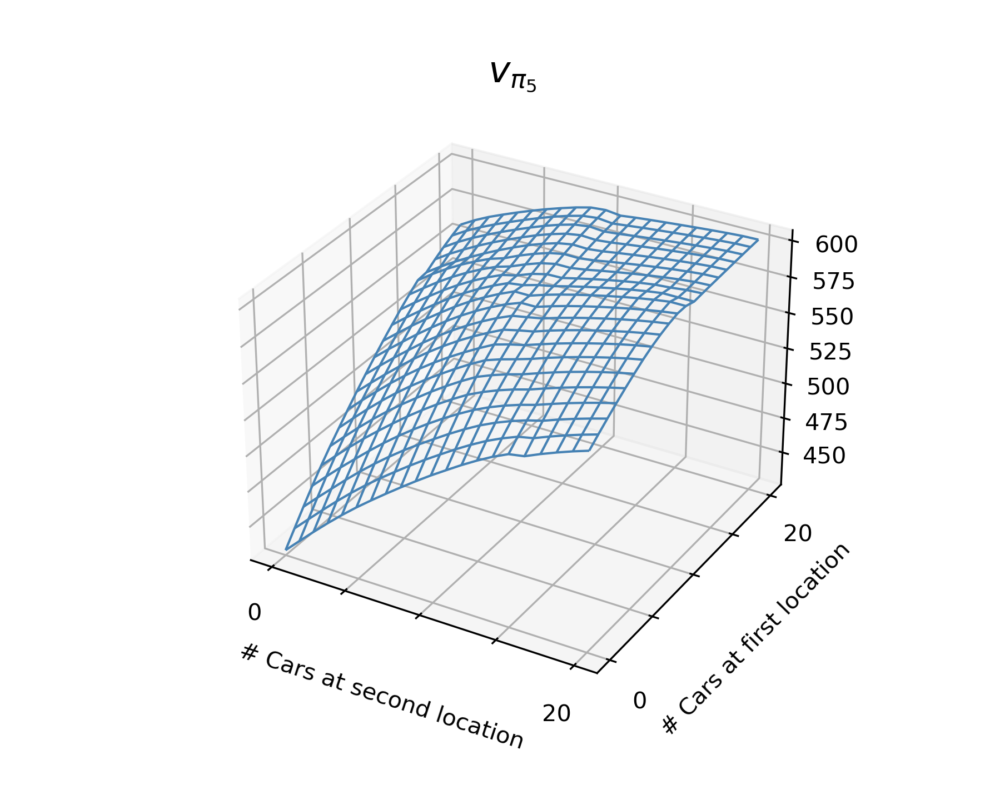
</p>

### 4.9 Resolve Gambler's Problem (*p.84*)
Implement value iteration for the gambler's problem and solve it for $p_h = 0.25$ and $p_h = 0.55$. [Code](./example_4_3_gambler.py)
#### $p_h = 0.25:$
<p align="center">
    
    
    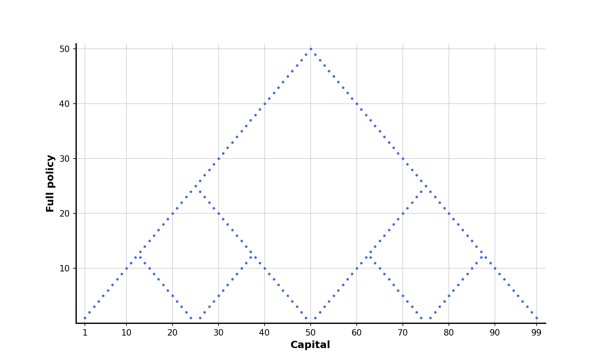
</p>

#### $p_h = 0.55:$
<p align="center">
    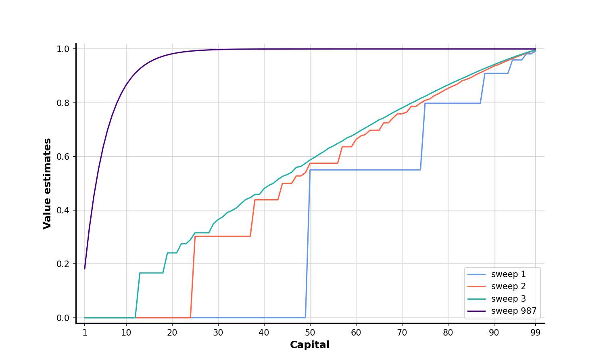
    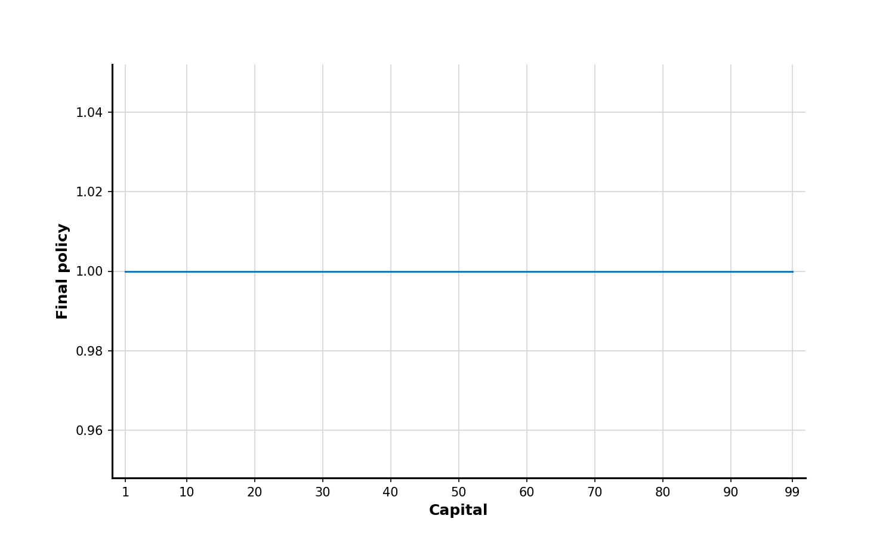
    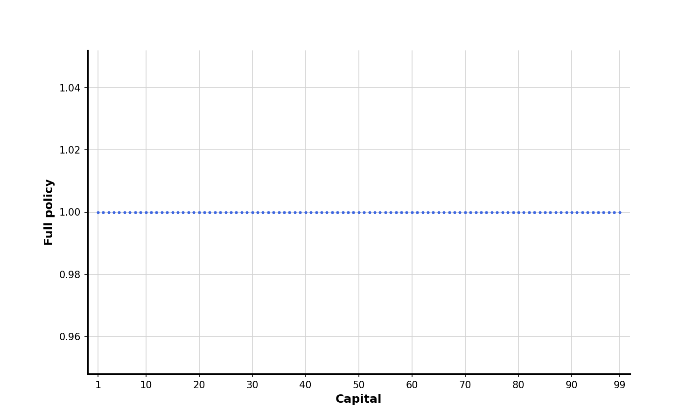
</p>