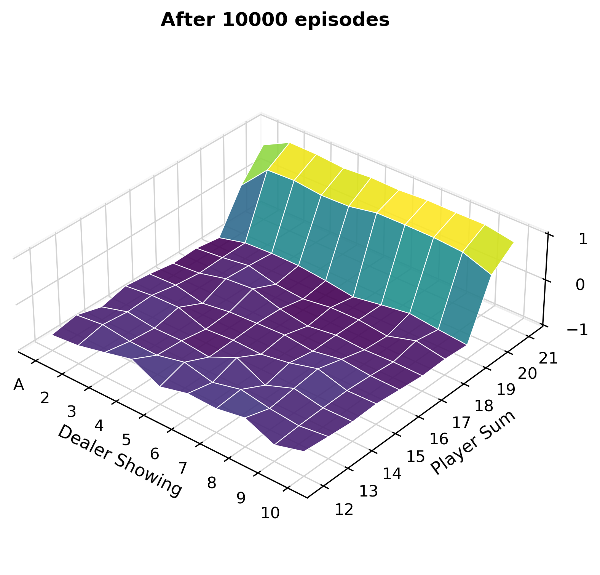
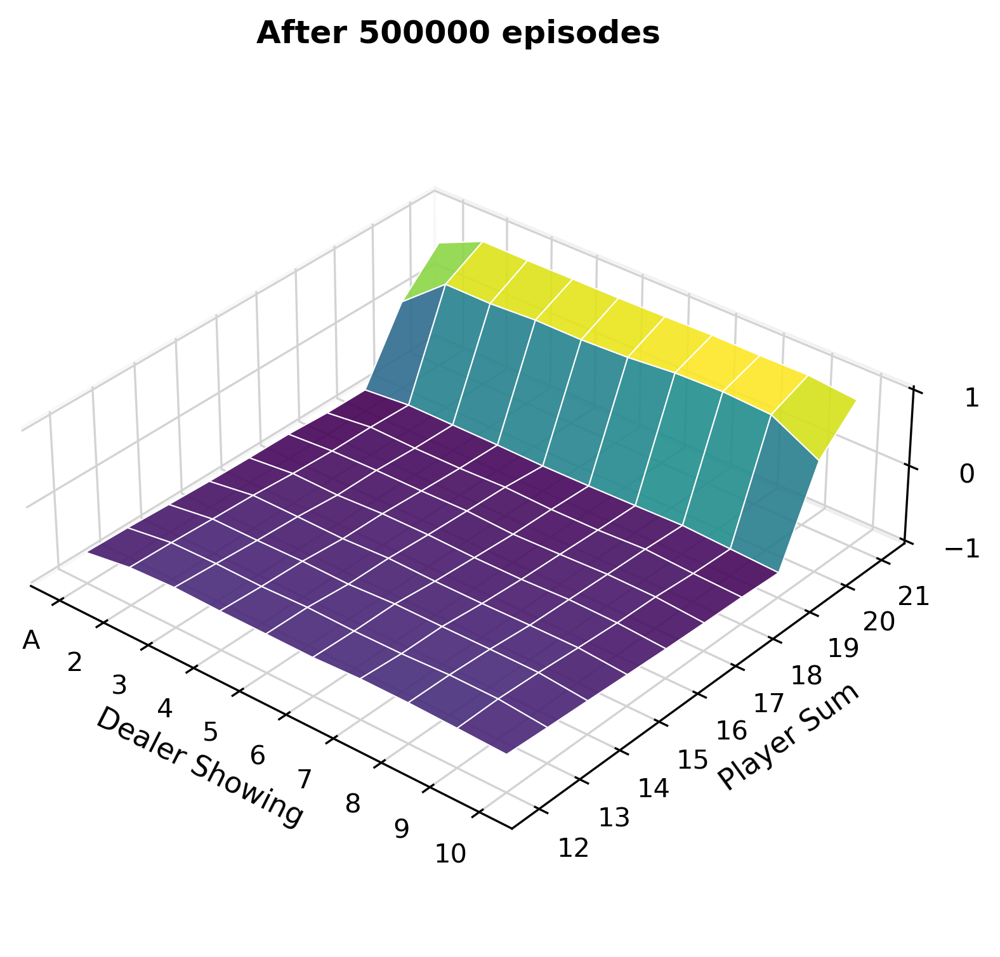

# **Chapter 5: Monte Carlo Methods** &nbsp; &nbsp; :link: [Notes](./%5BNOTES%5DCH_5.pdf)

## Examples

### 5.1 Blackjack (*p.94*)

Approximate state-value functions for the blackjack policy that sticks only on 20
or 21, computed by Monte Carlo policy evaluation. (Due to the limitation of the Gymnasium Blackjack environment, the "no usable case" is temporarily not implemented, but will be updated in the future.) [Code](./example_5_1_blackjack.py)

    
    

