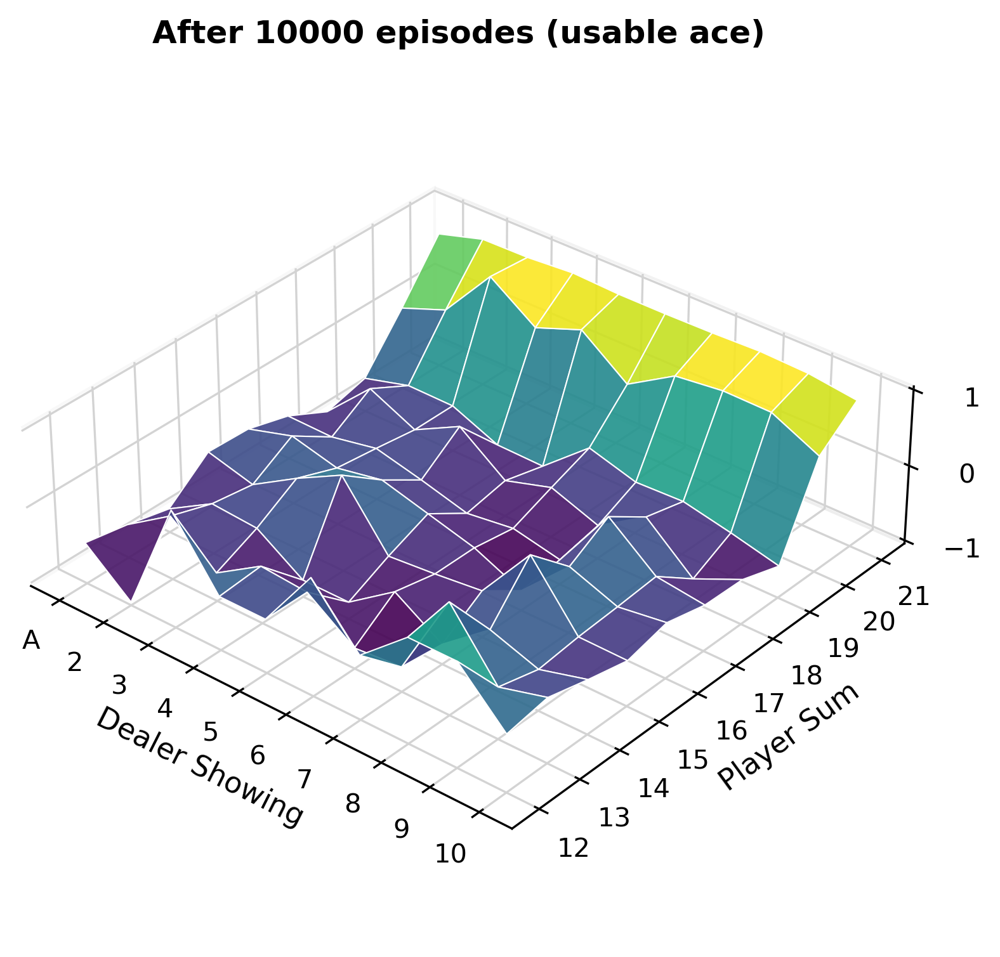
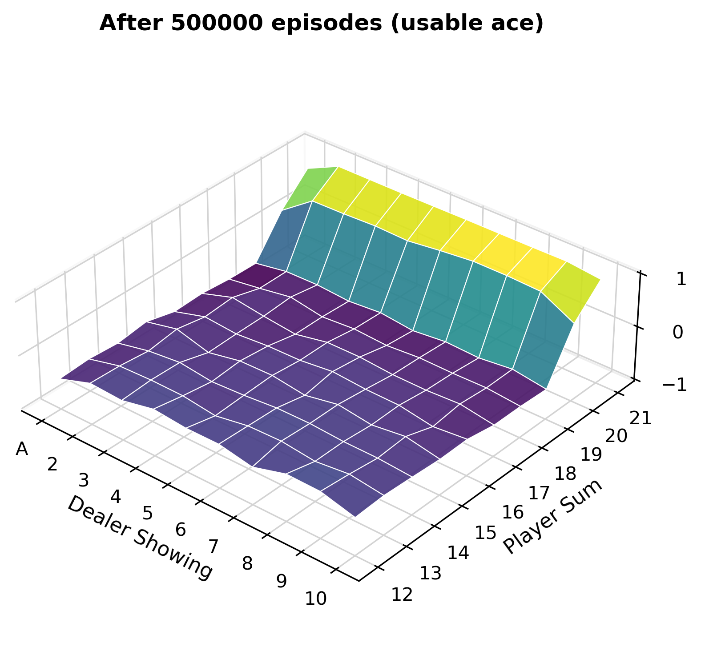
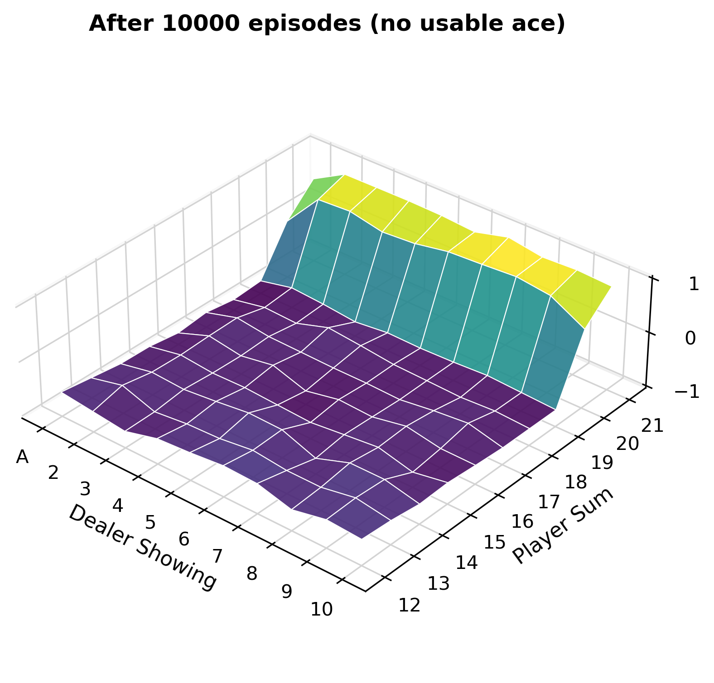
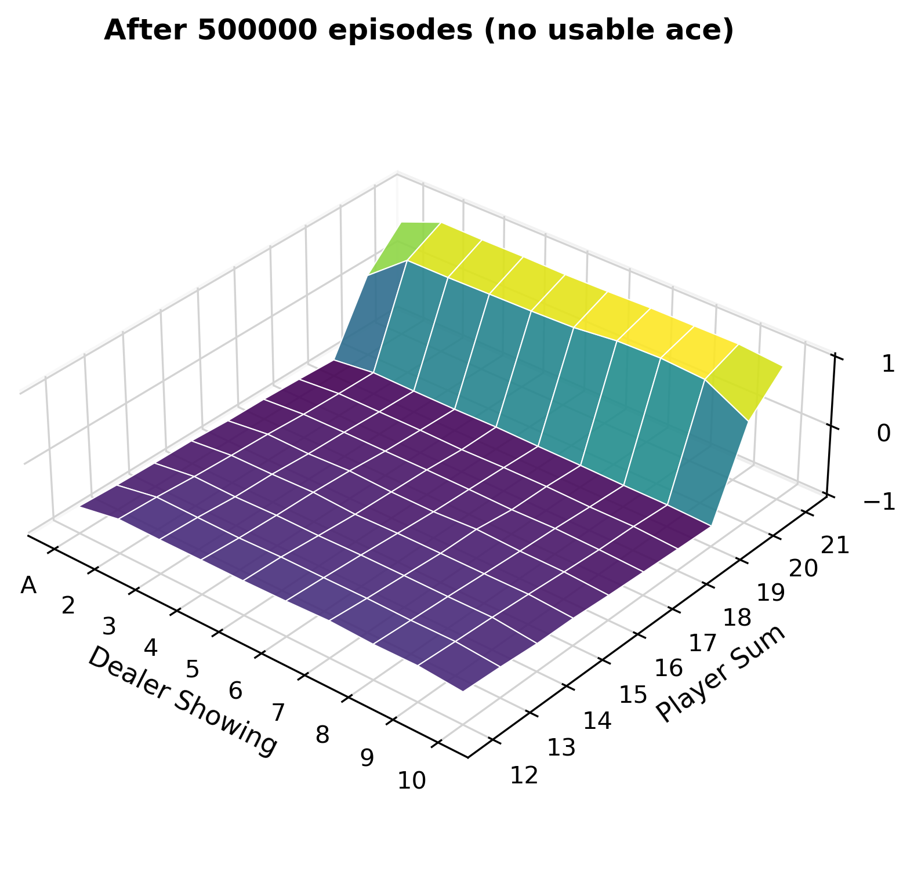
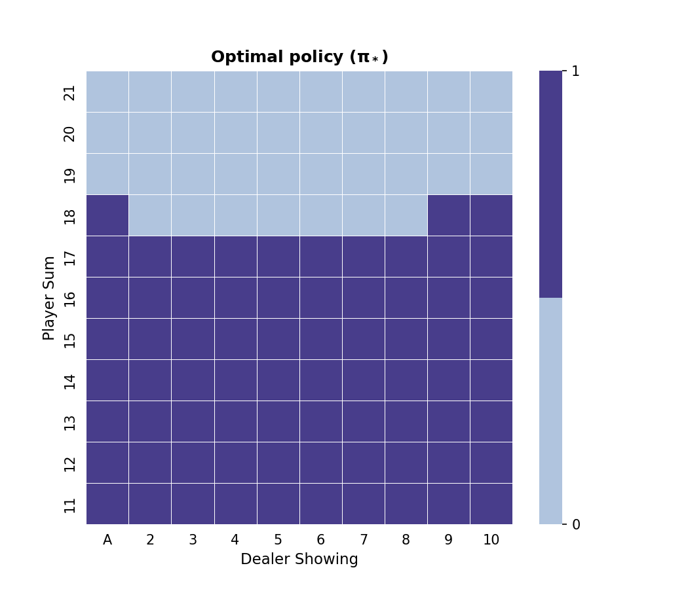
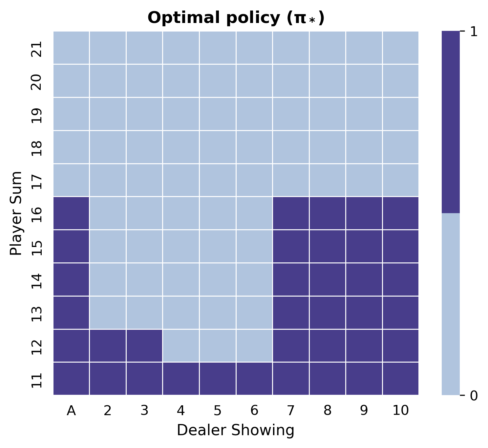
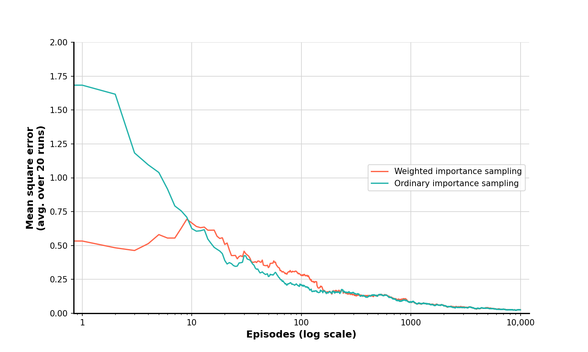
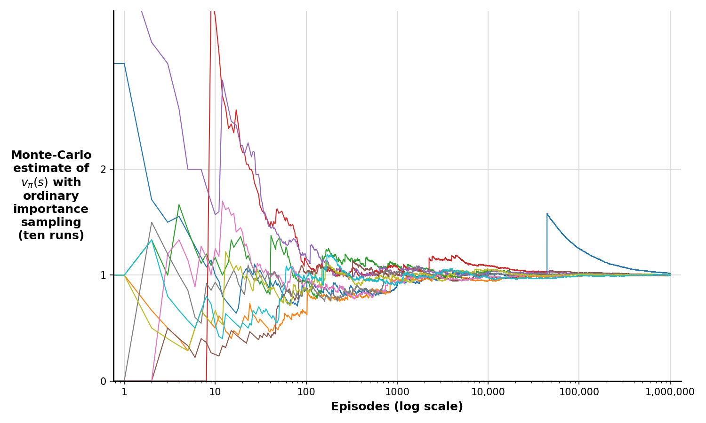
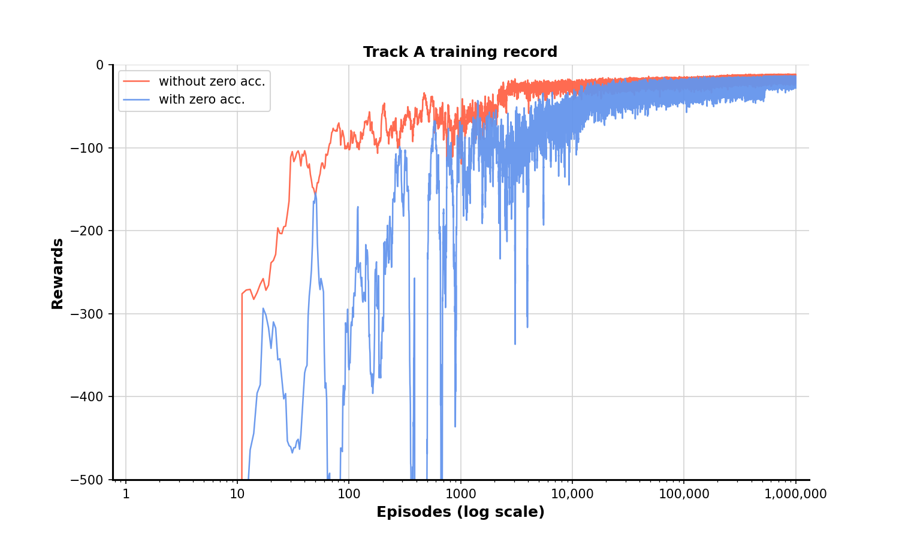
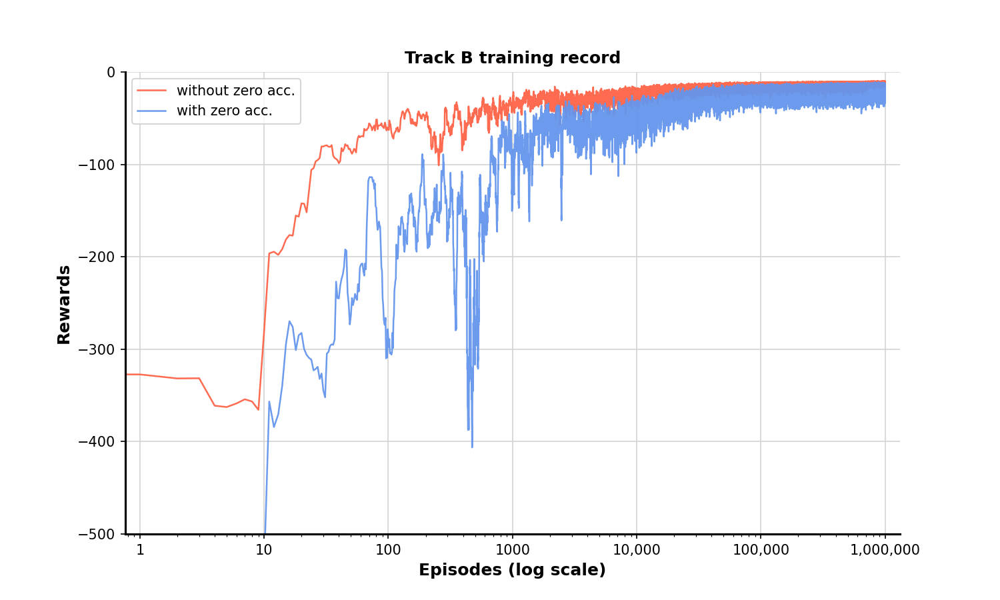

# **Chapter 5: Monte Carlo Methods** &nbsp; &nbsp; :link: [Notes](./%5BNOTES%5DCH_5.pdf)

## Examples

### 5.1 Blackjack (*p.94*)

Approximate state-value functions for the blackjack policy that sticks only on 20
or 21, computed by Monte Carlo policy evaluation. [Code](./example_5_1_blackjack.py)
 

**Usable ace:**

    
    

**No usable ace:**

    
    

### 5.3 Solving Blackjack (*p.99*)
Apply Monte Carlo ES to blackjack. The initial policy is to stick only on the player's sum is 20 or 21, and the initial action-value function is zero for all state-action pairs. [Code](./example_5_3_solving_blackjack.py)
 

**Usable ace:**

    
    

**No usable ace:**

    
    

### 5.4 Off-policy Estimation of a Blackjack State Value (*p.106*)
Evaluate the state in which the dealer is showing a deuce, the sum of the player’s cards is 13, and the player has a usable ace. The data was generated by starting in this state then choosing to hit or stick at random with equal probability (the behavior policy). The target policy was to stick only on a sum of 20 or 21, as in Example 5.1. The value of this state under the target policy is approximately −0.27726. [Code](./example_5_4_off_policy_estimation.py)
 

    

### 5.5 Infinite Variance (*p.107*)
Ordinary importance sampling produces surprisingly unstable estimates on the one-state MDP shown inset. The correct estimate here is 1 ($\gamma$ = 1), and, even though this is the expected value of a sample return (after importance sampling), the variance of the samples is infinite, and the estimates do not converge to this value. These results are for on-policy every-visit MC. [Code](https://github.com/terrence-ou/Reinforcement-Learning-2nd-Edition-Notes-Codes/blob/main/chapter_05_monte_carlo_methods/example_5_5_infinite_var.py)
 

    

## Exercise

### 5.12 Racetrack (*p.112*)

Consider driving a race car around a turn like those shown in Figure 5.5 (*p.112*). You want to go as fast as possible, but not so fast as to run out of the track. In our simplified racetrack, the car is at one of a discrete set of grid positions, the cells in the diagram. The velocity is also discrete, a number of grid cells moved horizontally and vertically per time step. The actions are increments to the velocity components. [Code](./exercise_5_12_racetrack.py)

**Track A**  
Training record:

    

Sample trajectories:

    

**Track B**  
Training record:

    

Sample trajectories:

    

