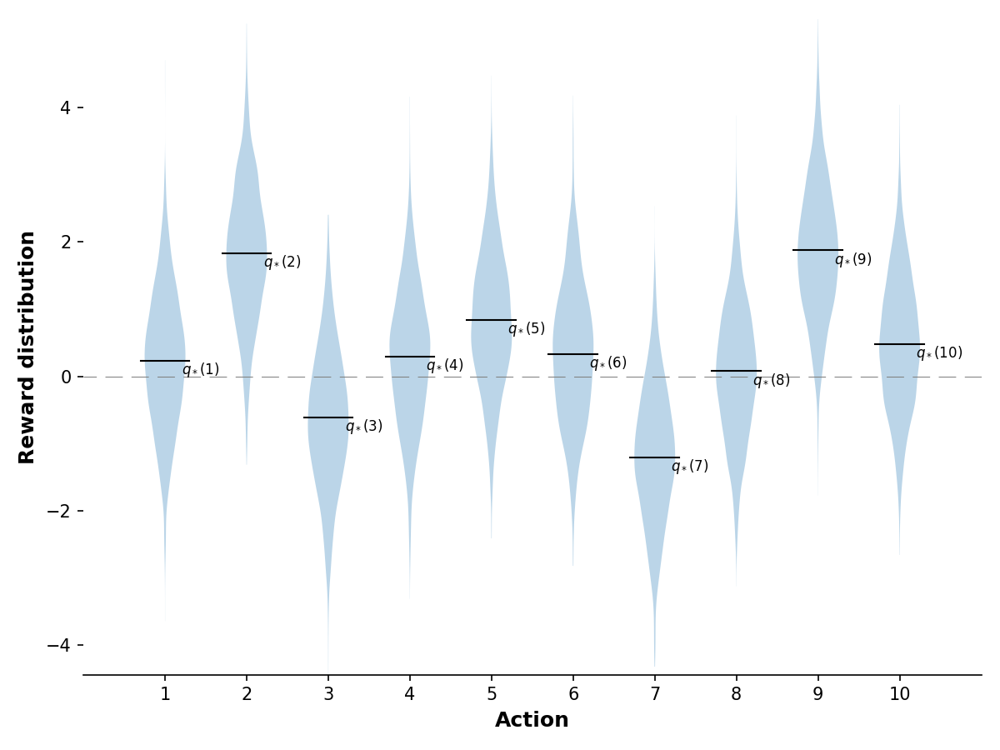
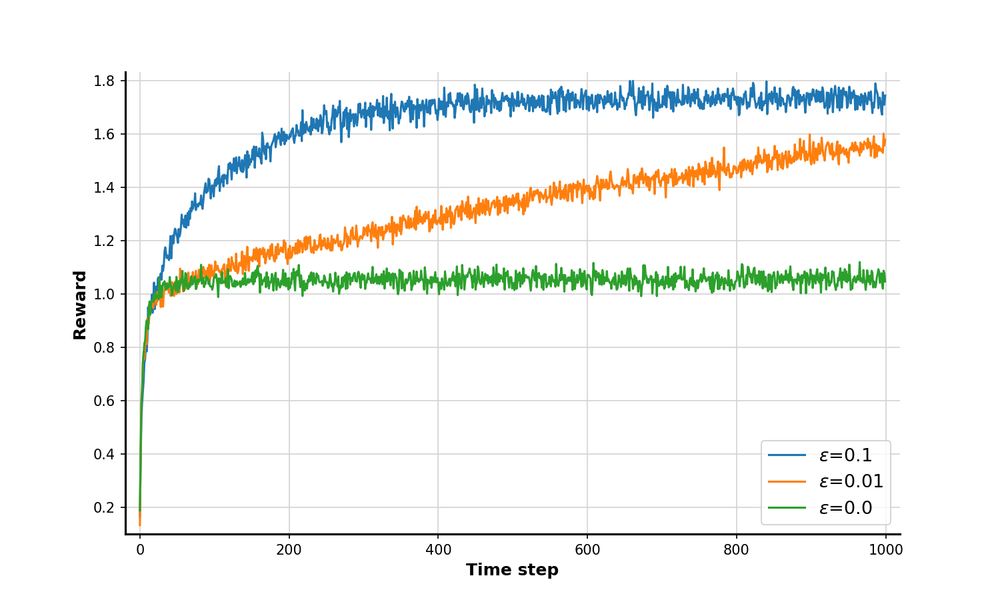
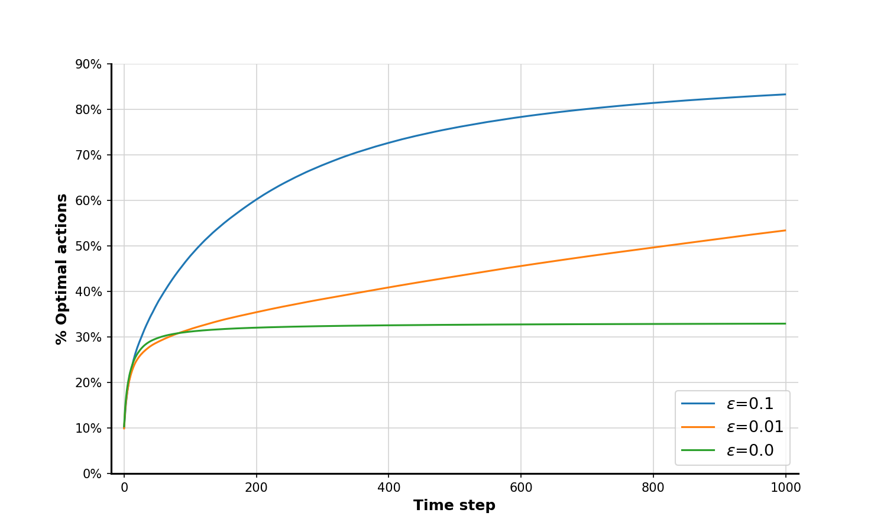
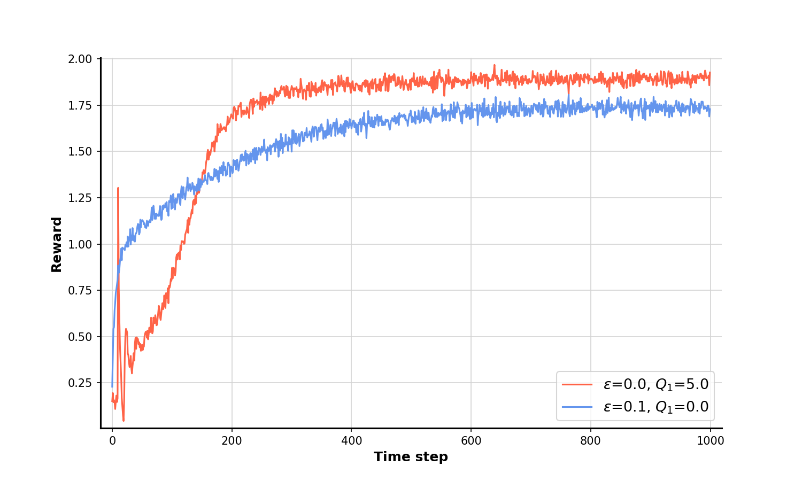
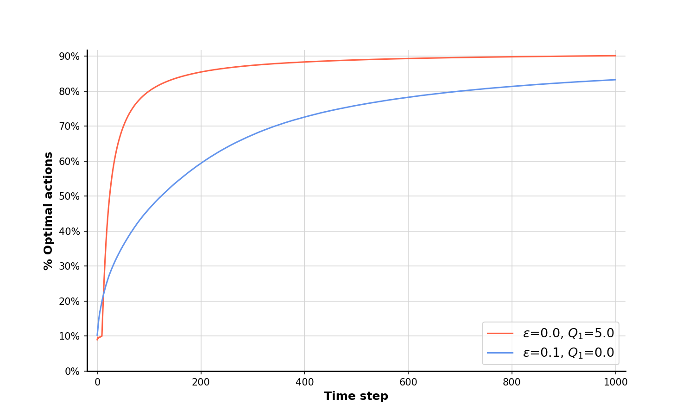
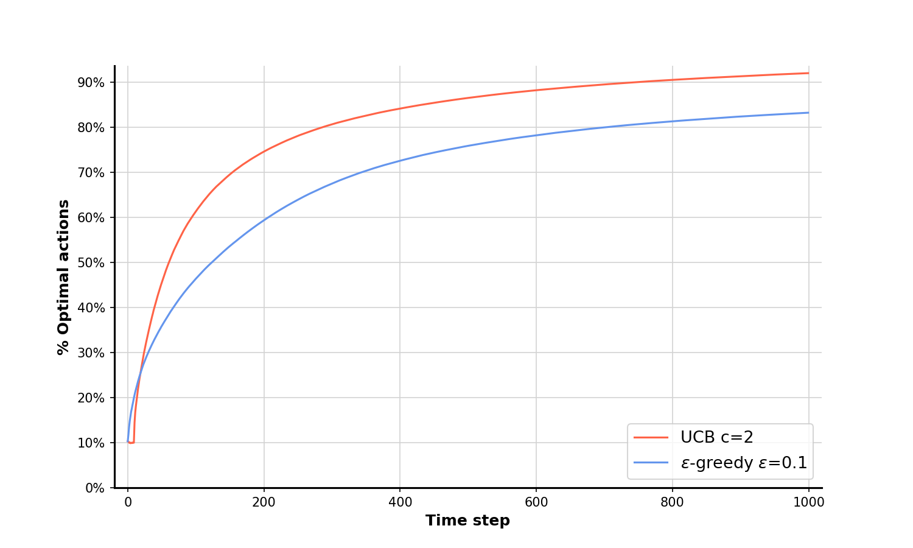
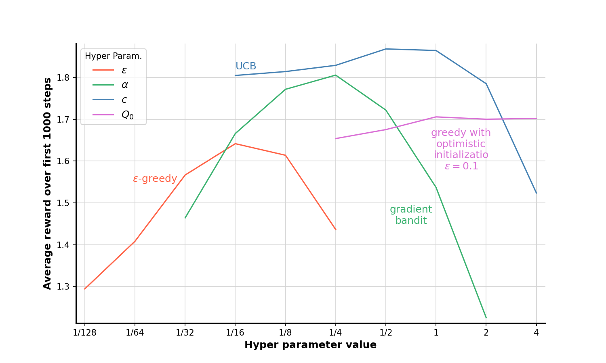
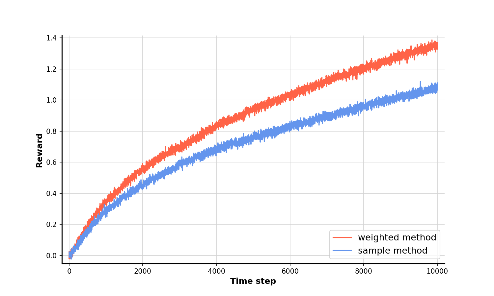
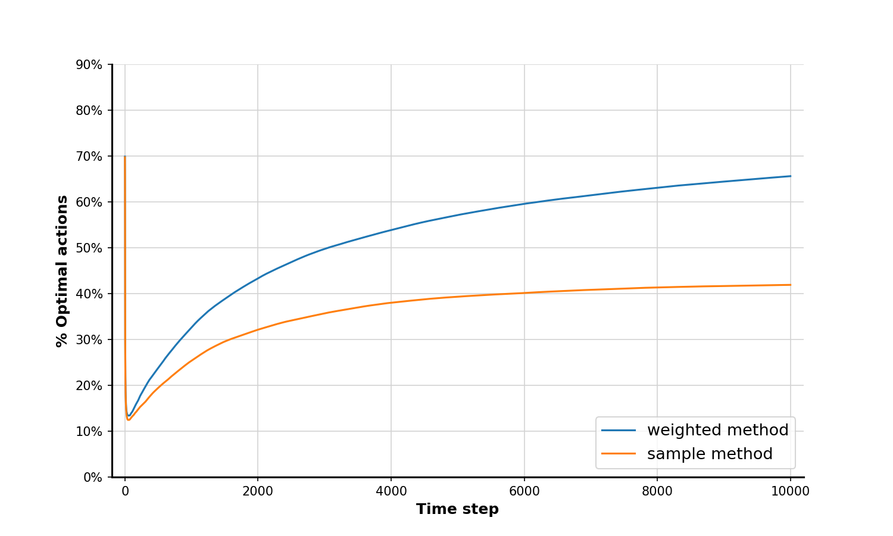
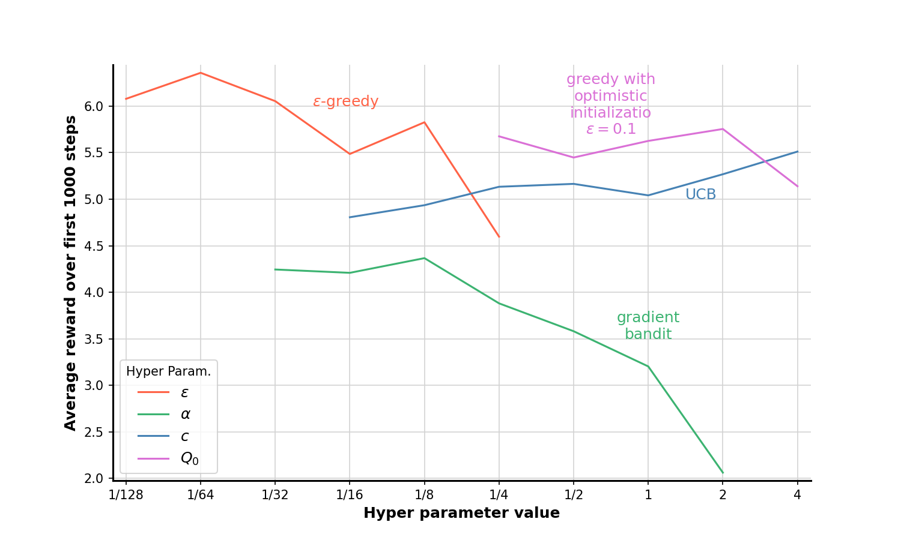

# **Chapter 2: Multi-armed Bandits** &nbsp; &nbsp; :link: [Notes](./%5BNOTES%5DCH_2.pdf)
## **Examples**

### 2.1 10-armed testbed (*p.28*)
A set of 2000 randomly generated k-armed bandits problem with k = 10. 
[Code](./example_2_1_distribution.py)

    

### 2.2 Average performance of $\varepsilon$-greedy action-value methods (*p.29*)
Run the 10-armed bandit algorithm on the testbed and compare the effect of using different $\varepsilon$ value.
[Code](./example_2_2_bandits_algo.py)

    
    

### 2.3 Optimistic Initial Values (*p.34*)
The effect of optimistic initial action-value estimates on the 10-armed testbed. Both methods used a constant step-size parameter, $\alpha=0.1$.  
[Code](./example_2_3_OIV.py)

    
    

### 2.4 Upper-Confidence-Bound action selection (*p.36*)
Average performance of UCB action selection on the 10-armed testbed. 
[Code](./example_2_4_UCB.py)

    
    

### 2.5 Gradient bandit algorithm (*p.38*)
Average performance of the gradient bandit algorithm with and without a reward baseline on the 10-armed testbed. 
[Code](./example_2_5_gradient.py)

    

### 2.6 Parameter study in stationary case (*p.42*)
Parameter study of the various bandit algorithms presented in the chapter.
[Code](./example_2_6_summary.py)

    

---

## **Exercises**

### 2.5 Tracking a non-stationary problem (*p.33*)
Use a modified version of the 10-armed testbed in which all the $q_*(a)$ start out equal and then take independent random walks (say by adding a normally distributed increment with mean zero and standard deviation 0.01 to all the $q_*(a)$ on each step). 
[Code](./exercise_2_5_non_stationary.py)

    
    

### 2.6 Parameter study in non-stationary case (*p.44*)
Parameter study of the various bandit algorithms presented in the chapter. 
[Code](./example_2_6_summary.py)

    

